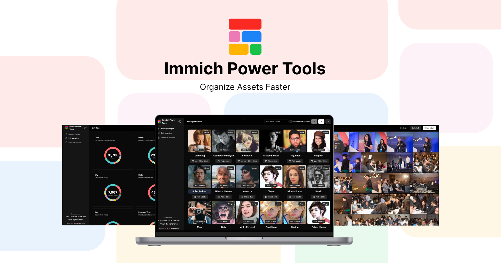

#  Immich Power Tools

A unofficial immich client to provide better tools to organize and manage your immich account. Building it to speed up your workflows in Immich to organize your people and albums.

[Watch Demo Video here](https://www.loom.com/embed/13aa90d8ab2e4acab0993bdc8703a750?sid=71498690-b745-473f-b239-a7bdbe6efc21)

[](https://www.loom.com/embed/13aa90d8ab2e4acab0993bdc8703a750?sid=71498690-b745-473f-b239-a7bdbe6efc21)

## 💭 Back story

Recently I've migrated my entire Google photos library to Immich, I was able to successfully migrate all my assets along with its albums to immich. But there were few things like people match that was lacking. I loved Immich UI on the whole but for organizing content I felt its quite restricted and I had to do a lot of things in bulk instead of opening each asset and doing it. Hence I built this tool (continuing to itereate) to make my life and any other Immich user's life easier.

## 🚀 Getting Started

### 🐬 Using Docker

#### Power-tools is designed to be used alongside Immich, and there are two ways you can run it.
#### Method 1 - Docker Compose ( Recommended )

Add the following into your docker compose as a new service along side other immich services. Make sure you've `power-tools` in same network as immich.

See the sample [docker-compose-all-immich.yml](./docker-compose-all-immich) file for reference.

```yaml
services:
  # Other services...
  power-tools:
    container_name: immich_power_tools
    image: ghcr.io/varun-raj/immich-power-tools:latest
    ports:
      - "8001:3000"
    env_file:
      - .env
```

Add the Immich API Key to the env file (which you already have for the immich)

```bash
IMMICH_API_KEY= # your_immich_api_key
```
Refer here for obtaining Immich API Key: https://immich.app/docs/features/command-line-interface#obtain-the-api-key
#### Method 2 - Portainer

If you're using portainer, run the docker using `docker run` and add the power tools to the same network as immich.

```bash
docker run -d --name immich_power_tools -p 8001:3000 --env-file .env ghcr.io/varun-raj/immich-power-tools:latest
```


### 🚀 For local development

> [!NOTE]  
> Please use `bun` to run the project. If you don't have `bun` installed, checkout [bun.sh](https://bun.sh/) for installation.


Copy paste the `.env.example` to `.env` and fill in the values.

```bash
  IMMICH_URL="" # Immich URL
  IMMICH_API_KEY="" # Immich API Key
  DB_USERNAME="" # Postgress Database Username
  DB_PASSWORD = "" # Postgres Database Password
  DB_HOST = "" # Postgres Host (IP address or hostname of the database)
  DB_PORT = "" # Postgres Port number (Default: 5432)
  DB_DATABASE_NAME = "" # Name of the database 
```
> [!NOTE]  
> Make sure you have postgres port exposed on you machine.

Refer here for obtaining Immich API Key: https://immich.app/docs/features/command-line-interface#obtain-the-api-key

Run the development server:

```bash
bun run dev
```

## Features

**Immich Related**

- [x] Manage People
  - [x] Smart Merge
- [ ] Manage Albums
  - [ ] Bulk Delete
  - [ ] Bulk Edit
  - [ ] Filters
  - [x] Potential Albums
- [ ] Statistics
  - [x] EXIF Data
  - [ ] Assets Overtime Chart

**Tech Related**

- [x] Dark Mode
- [x] Dockerize
- [ ] Authentication
- [x] Push to github packages

## Tech Stack

- [Next.js](https://nextjs.org/) for infrastructure
- [Tailwind CSS](https://tailwindcss.com/) for styling
- [Shadcn](https://shadcn.com/) for UI Components
- [Axios](https://axios-http.com/) for API calls

## Contributing

Feel free to contribute to this project, I'm open to any suggestions and improvements. Please read the [CONTRIBUTING.md](./CONTRIBUTING.md) for more details.
